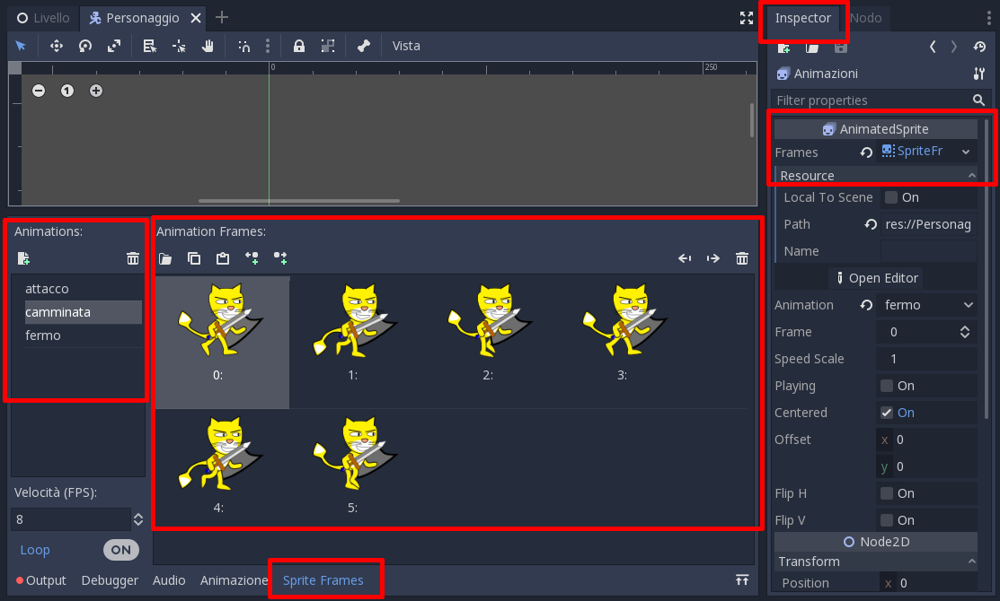

.. _ComeSiFa:

**********************
Come si fa
**********************

Questa sezione spiega come fare delle cose specifiche in Godot. 

Fare qualcosa se un tasto è premuto
================================================

Per fare qualcosa quando si preme un tasto, bisogna innanzitutto configurare un'azione nel menu ``Progetto->Impostazioni Progetto->Mappa Input``:

Si scrive il nome dell'azione e si preme su ``Aggiungi``:

Poi si specifica il tasto:

.. figure:: img/premi_tasto.png
   :alt: Premi un Tasto

Infine, si può usare l'azione nel codice: ::

    var colpisci = Input.is_action_pressed('colpisci')
    if colpisci:
        # fai qualcosa

.. IMPORTANT:: ci sono due funzioni simili: ``Input.is_action_pressed`` e ``Input.is_action_just_pressed``. La prima 
    serve per controllare se il tasto è premuto. La seconda per controllare se è stato **appena** premuto. La prima funzione va 
    bene ad esempio per i tasti freccia, perchè finchè il tasto è premuto, il personaggio si sposta. La seconda va bene per quando
    si attacca: ogni volta che viene premuto il tasto, il personaggio attacca 

Animazioni!
================================================

In Godot per fare le animazioni si usano i Nodi di tipo `AnimatedSprite`. 

Ad esempio per il gioco del Cavaliere Miaogico, usiamo il nodo `Animazioni`:

Cliccando sul nodo, possiamo vedere che una delle sue proprietà si chiama `Frames`. I `Frames` sono un pò come i costumi di Scratch, ma possono essere raggruppati in animazioni diverse. Cliccando sulla parte bassa della finestra di Godot, sulla parola `SpriteFrames`, vengono visualizzate tutte le animazioni presenti.
Ad esempio per il gioco del Cavaliere Miaogico, ci sono animazioni diverse per l'attacco e la camminata; ognuna ha i suoi costumi:

Per far partire un'animazione usiamo le funzioni `play()` e `stop()`. Ad esempio, nello script del Personaggio: ::

    $Animazioni.play("camminata")
    $Animazioni.set_flip_h(true)

.. NOTE:: la funzione `set_flip_h(true)` serve per riflettere orizzontalmente l'animazione. Serve per poter usare la stessa animazione sia quando il Personaggio è rivolto verso destra che verso sinistra.

Animazioni Avanzate con il nodo `AnimationPlayer`
===================================================

Il nodo `AnimationPlayer` consente di creare animazioni più complesse che agiscono su più nodi.

Terminologia
--------------

Un nodo `AnimationPlayer` può contenere più `Animazioni`. Ad esempio, l'animazione per la camminata, l'animazione per l'attacco, etc.

Ogni `Animazioni` è fatta da una o più `tracce`. Ogni `traccia` anima un solo elemento, ad esempio:

- una proprietà di un oggetto, come la posizione, o il "costume" di un personaggio.
- una funzione che viene chiamata

Le tracce sono costituite da `keyframe`, cioè momenti specifici dell'animazione in cui succede qualcosa. Un'immagine vale più di mille parole, quindi prendiamo un esempio:

.. figure:: img/animationplayer/camminata.png
   :alt: L'animazione di una camminata

La schermata mostra i dettagli di un'animazione chiamata "camminata". L'animazione dura 0.6 secondi. Ci sono 6 `keyframe`\ s, uno ogni 0.1 secondi. Ogni `keyframe` corrisponde a un'immagine del gatto che cammina.
Quando facciamo "play", Godot modifica la proprietà "frame" dello sprite, impostando via via un "costume" diverso.

Creiamone una
--------------

Proviamo a creare l'animazione da zero. 

.. TIP:: Per seguire questo pezzo della guida, apri l'esercizio Gatthor-1 che si trova nella cartella dei materiali

Clicchiamo su `Animazione` e selezioniamo `Nuovo`, poi diamo il nome all'animazione:

Impostiamo la durata (sulla destra, vicino al simbolo dell'orologio), quindi creiamo una nuova `Traccia`. La creiamo di tipo `Property Track` perchè vogliamo animare una `proprietà` del nodo `Sprite`, che contiene tutti i "costumi" del nostro personaggio.

Godot ci chiede di scegliere quale nodo animare: scegliamo `Sprite`, e scegliamo la proprietà `frame`. 

A questo punto non ci resta che cominciare ad aggiungere i `keyframe`. Selezioniamo lo sprite, e vicino alla proprietà `frame` vedremo un piccolo simbolo di una chiave. Scegliamo il frame 0 usando le freccine vicino alla chiave, e poi clicchiamo il simbolo della chiave:

Godot inserirà il primo frame. Inoltre farà un pò di cose:

- sposterà il punto di inserimento del prossimo keyframe all'istante "0.1"
- selezionerà già il prossimo "costume" dello sprite del gatto

Continuando a cliccare il simbolo della chiave, inseriremo gli altri `keyframe`

A questo punto non ci resta che premere "play" e osservare il risultato.

Negli script, le animazioni si fanno partire anche in questo caso con il metodo "play": ::

    $AnimationPlayer.play("camminata")

Aggiungere una "Camera"
================================================

La ``Camera`` serve per inquadrare sempre il personaggio anche se il livello è più grande dello schermo

Per prima cosa bisogna aggiungere un nodo ``Camera2d`` al personaggio:

Poi si configurano le opzioni. ``Current`` va impostato a ``On`` se si vuole che la ``Camera`` sia attiva. I ``Limiti`` servono per fare in modo che la ``Camera`` non inquadri mai oltre il bordo del livello. In questo esempio sono impostati a mano:

Disegnare il livello
================================================

Per disegnare il livello bisogna agire sul nodo `TileMap` (letteralmente vuol dire "mappa di piastrelle"):

Selezionando il nodo `TileMap` appaiono tante piastrelle diverse utilizzabili

.. NOTE:: le piastrelle le abbiamo preparate noi. Per prepararle bisogna fare un pò di passaggi, che spiegheremo in un altro "come si fa". 

Dopo aver selezionato una piastrella:

- con il tastro sinistro si aggiunge la piastrella al livello
- con il tasto destro si cancella

il tasto sinistro / destro si possono anche tenere premuti, per essere più veloci.

Usare i "segnali"
================================================

In Godot alcuni nodi hanno la possibilità di mandare dei "segnali", che sono un pò come i messaggi di Scratch.
In Godot però i messaggi non vengono inviati a tutti gli altri nodi. Bisogna collegarli. Per farlo, bisogna andare nella sezione "Nodo" del nodo. Ad esempio per il gioco del Cavaliere Miaogico, usiamo il nodo `Slash`

Scegliamo il segnale che ci interessa: `body_entered`, che vuol dire che un altro oggetto (in questo caso un nemico) è "entrato" nello slash (o viceversa):

E lo colleghiamo a una funzione. Godot è così gentile da creare per noi una funzione con un nome appropriato:

Infine possiamo fare qualcosa nella funzione, ad esempio: ::

    func _on_Slash_body_entered(body):
        if "Alieno" in body.name:
            body.morto()
            queue_free()

Scegliere la scena iniziale
================================================
I giochi in Godot sono organizzati in scene. Quando premiamo il tasto "play", Godot fa partire la scena iniziale.
La scena iniziale si imposta dal menù `Progetto -> Impostazioni Progetto`>:

La scena iniziale si sceglie nella sezione `Run`:

