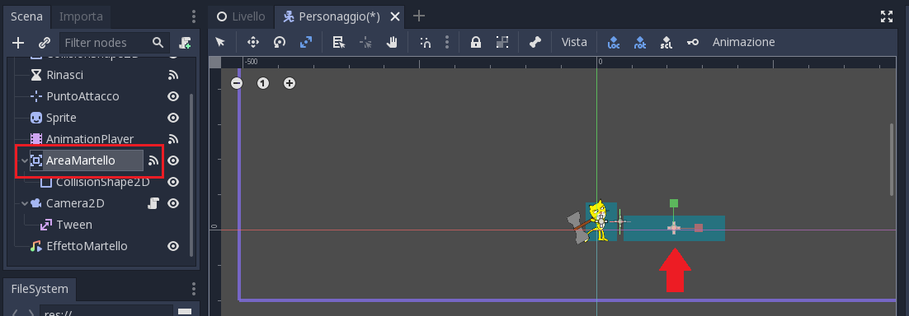
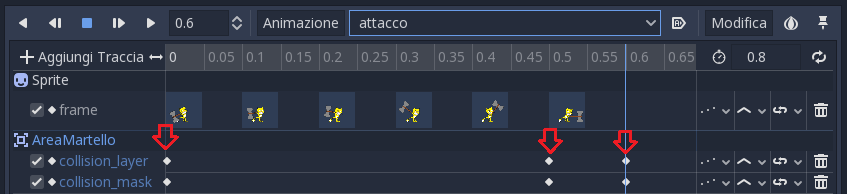
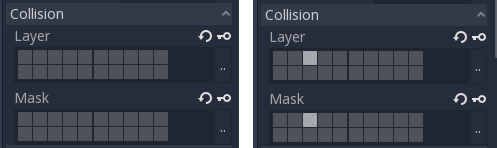

.. _Gatthor1:

Gatthor - Esercizio 1
=====================================

Per questo esercizio ti serve il progetto di che si trova nella cartella ``materiale\Gatthor\esercizio1``.

In questo esercizio esploriamo le potenzialità del nodo `AnimationPlayer` di Godot, con cui si può animare di tutto!
I passaggi dell'esercizio sono:

- Animazione dell'attacco
- Colpire i nemici
- Scuotere lo schermo
- Suoni!

.. TIP:: Aiutati con il :ref:`ComeSiFa` !

Animazione dell'attacco
------------------------------------------------------
Vogliamo creare l'animazione dell'attacco. 

.. TIP:: Aiutati con il :ref:`ComeSiFa` ! Basta creare un'animazione di nome "attacco" e scegliere i keyframe giusti

Colpire i nemici
------------------------------------------------------
Con le animazioni si possono fare tante cose, ad esempio attivare o disattivare degli elementi del gioco. Soprattutto, possiamo coordinare le animazioni su vari oggetti.

Usiamo questa tecnica per colpire i nemici. Il nostro personaggio ha un nodo ``AreaMartello`` di tipo ``Area2D``:

Useremo un'animazione per attivarla e disattivarla. Dobbiamo:

- creare una nuova ``traccia`` nella animazione `attacco`, per il nodo ``AreaMartello`` e in particolare per 2 proprietà: ``collisionlayer`` e ``collisionmask``
- inserire i keyframe. In particolare:
    - all'istante 0, la collision mask e il collision layer devono essere tutti spenti
    - nell'istante in cui il martello tocca terra, sia la collision mask che il collision layer dovranno avere il terzo quadretto acceso. In questo modo "rileveranno" la presenza di nemici in quello spazio
    - all'istante 0.6, la collision mask e il collision layer devono essere di nuovo tutti spenti

Di seguito un'immagine della traccia:

NOTA: di seguito anche un'immagine con i collision mask e layer "spenti" e "accesi"

La ``AreaMartello`` è configurata per gestire il segnale ``body_entered``. Prova a sbirciare cosa fa lo script!

Scuotere lo schermo
------------------------------------------------------
Quando il martello tocca terra, facciamo scuotere lo schermo. Ormai sai benissimo come funzionano le animazioni, quindi qui di seguito riporto solo le proprietà da animare:

- creare una nuova ``traccia`` nella animazione `attacco`, per il nodo ``Camera2D`` e in particolare per la proprietà ``offset``
- inserire i keyframe. In particolare:
    - all'istante 0.5, l'offset vale 0 sia per il valore x che per il valore y
    - all'istante 0.6, l'offset vale 0 per la x e 10 per la y (lo schermo si sposta verso l'alto)
    - all'istante 0.7, l'offset vale 0 per la x e -10 per la y (lo schermo si sposta verso il basso)
    - all'istante 0.8, l'offset vale 0 sia per il valore x che per il valore y (lo schermo torna al suo posto)

Suoni!
------------------------------------------------------
Quando il martello tocca terra, fa tanto rumore!

Anche in questo caso usiamo una traccia; questa volta tuttavia non usiamo una ``Property Track`` ma una ``Call Method Track``. In questo modo possiamo chiamare un metodo. Il metodo che ci serve è il metodo ``play()`` del nodo ``EffettoMartello``.

Questa traccia avrà un solo ``keyframe``, nello stesso istante in cui il martello tocca terra.

