.. _IlCavaliereMiaogico2:

Il Cavaliere Miaogico - Esercizio 2
=====================================

Per questo esercizio ti serve il progetto di base `Il Cavaliere Miaogico`

In questo esercizio:

- Vediamo come cambiare scena
- Creiamo un "nemico timido"

.. TIP:: Aiutati con il :ref:`ComeSiFa` !

Cambiare Scena
------------------------------------------------------
Per prima cosa, creiamo un oggetto che ci serva per cambiare scena. Tecnicamente non è l'unico modo per cambiare scena, ma questo modo si applica bene al nostro gioco. L'oggetto che creiamo è una porta. Siccome Godot si basa sul concetto di scena, la nostra porta è di fatto una scena. Dal menù ``Scena`` scegliamo ``Nuova Scena``:

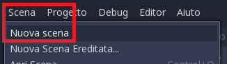

Dobbiamo creare un insieme di nodi, uno dentro l'altro

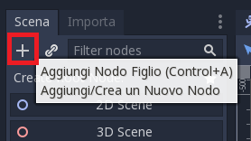

Creiamo un nodo di tipo ``Area2D`` che chiamiamo ``Porta``, poi ci aggiungiamo dentro due nodi, uno di tipo ``Sprite`` e l'altro di tipo ``CollisionShape2D``. Alla fine la nostra scena dovrebbe essere fatta così:

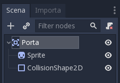

Non abbiamo ancora finito. Dobbiamo fare ancora due cose: la prima è scegliere un'immagine per la porta.

Per farlo dobbiamo selezionare il nodo ``Sprite``, e nelle proprietà del Nodo, scegliere la texture:

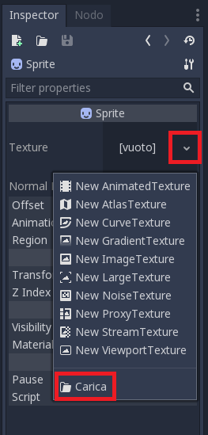

Dobbiamo scegliere l'immagine `porta.png` che si trova nella cartella dell'esercizio 2:

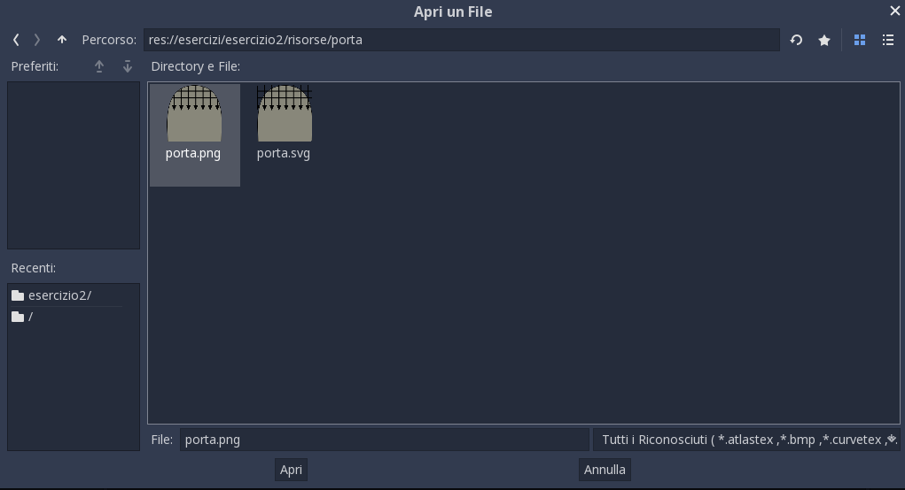

A questo punto dobbiamo dire a Godot qual'è l'area da controllare. Nel senso: l'area in cui Godot deve controllare se c'è il nostro eroe... nel qual caso, farà qualcosa. Dobbiamo selezionare il nodo ``CollisionShape2D`` e selezionare una ``RectangleShape2D`` come forma:

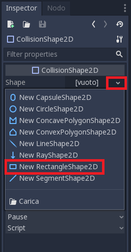

Dobbiamo agire sulle maniglie per regolare la forma:

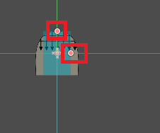

Infine aggiungiamo uno script alla Porta: selezioniamo il nodo e poi in fondo, nello script, selezioniamo "Carica". Dobbiamo caricare lo script `Porta.gd`:

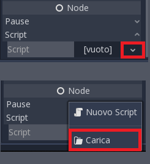

Ultimo passaggio per la `Porta`: colleghiamo il segnale `body_entered`. Questo lo puoi vedere nel :ref:`ComeSiFa` !

Commentiamo un attimo lo script: ::

    extends Area2D

    # La "export" serve per rendere visibile questa variabile
    # nell'editor
    export(String,FILE,"*.tscn") var scena_destinazione

Questa prima parte serve per consentirci di scegliere a quale scena conduce la porta. ::

    func _on_Porta_body_entered(body):
        if "Personaggio" in body.name:
            get_tree().change_scene(scena_destinazione)

Quando il personaggio entra nell'area, usiamo la funzione ``change_scene`` di Godot.

É venuto il momento di usare la nostra porta. Innanzitutto apriamo la scena del livello 2, poi clicchiamo sul simbolo della catena:

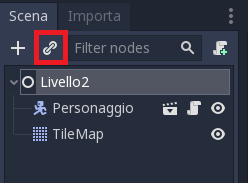

E scegliamo la nostra porta

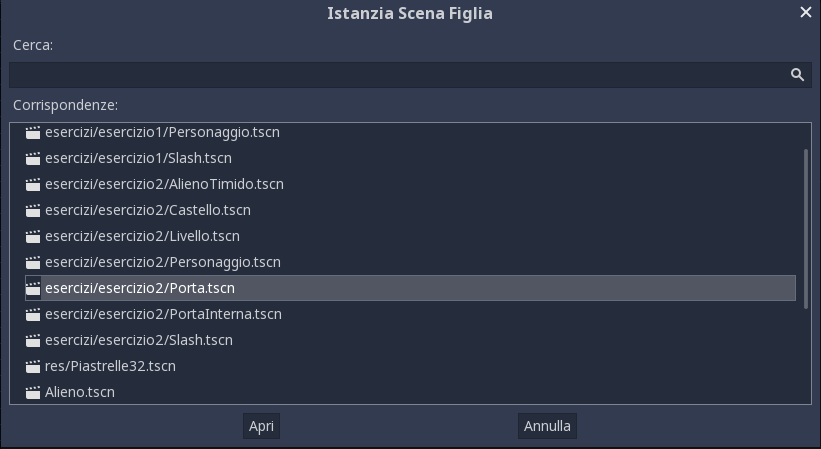

Posizioniamo la nostra porta in un punto a nostra scelta. Prima di provarla, dobbiamo dire a quale scena conduce. Selezioniamo la porta, e clicchiamo su ``Scena Destinazione`` (vi ricordate? Avevamo creato una "export" proprio per poterla scegliere!)

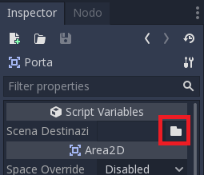

Scegliamo il Castello, che si trova nella cartella dell'esercizio 2.

Infine torniamo sulla scena "Livello" e facciamo partire la scena:

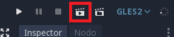

Nemico Timido
------------------------------------------------------
Creiamo un nemico timido: se mentre cammina si avvicina troppo a noi, si volta e scappa.

Innanzitutto aggiungiamo un ``RayCast2D``: è un "raggio" virtuale che Godot spara di continuo, e nello script possiamo controllare se questo raggio tocca qualcosa. Dobbiamo aggiungere il nodo ``RayCast2D`` alla scena chiamata ``AlienoTimido``:

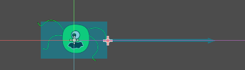

Se non è girato dal verso giusto, possiamo aggiustarlo modificandone le proprietà:

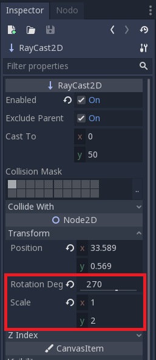

Poi dobbiamo scrivere qualcosa nello script. 

.. HINT:: Ecco come fare

    Usiamo la funzione ``is_colliding`` che serve a capire se il raggio tocca qualcosa. Poi controlliamo il nome dell'oggetto che il raggio sta toccando. Se è il Personaggio, allora l'alieno si volta. Inoltre si "spaventa": provate a capire cosa succede! ::

        if $RayCast2D.is_colliding():
        if "Personaggio" in $RayCast2D.get_collider().name:
            voltati(vel_precedente)
            velocity.x = velocity.x * 2
            $Spaventato.start()

