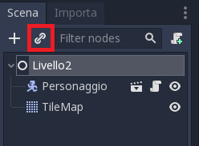
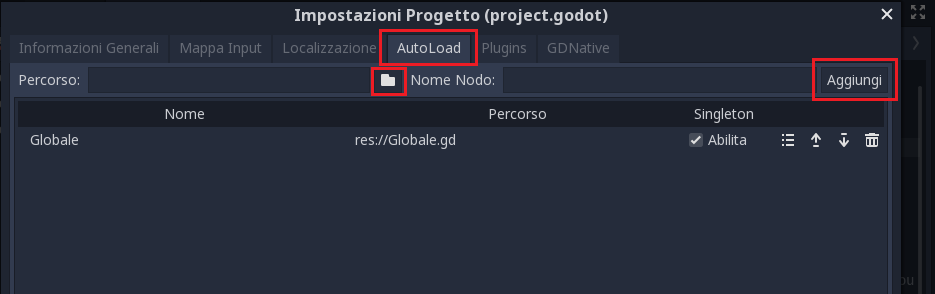
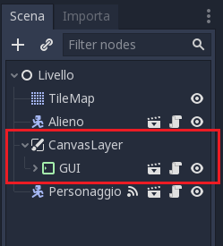
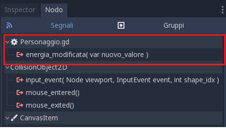
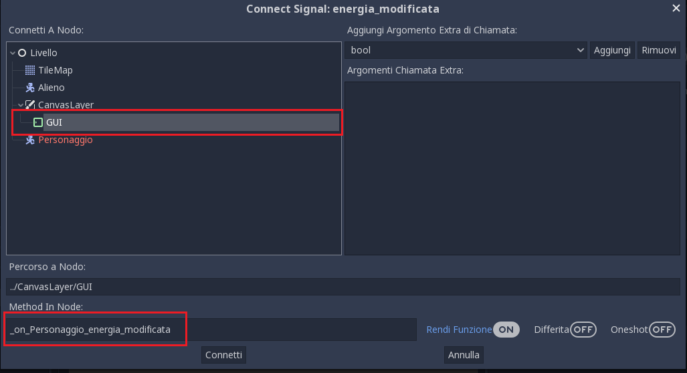

.. _IlCavaliereMiaogico3:

Il Cavaliere Miaogico - Esercizio 3
=====================================

Per questo esercizio ti serve il progetto di che si trova nella cartella ``materiale\esercizio3``.

In questo esercizio:

- Impariamo a far comparire il personaggio in un punto preciso della scena quando entra in una porta
- Aggiungiamo i punti salute e li visualizziamo sullo schermo

.. TIP:: Aiutati con il :ref:`ComeSiFa` !

Comparire in un punto preciso
------------------------------------------------------
Nell'esercizio 2 abbiamo visto come creare delle porte per raggiungere altre scene. Tuttavia, c'era un problema: tornando indietro, il personaggio compariva sempre all'inizio del livello. In questo esercizio, vediamo come risolvere il problema!

Dobbiamo:

- Inserire, in ogni livello, dei punti di ingresso 
- Modificare la ``Porta`` in modo da specificare non solo la scena di destinazione, ma anche il punto
- Modificare il ``Personaggio`` in modo da comparire nel punto di destinazione

Passo 1: inserire i punti di ingresso 
^^^^^^^^^^^^^^^^^^^^^^^^^^^^^^^^^^^^^^^^

Questo è facile! Basta creare dei nodi di tipo ``Position2D``. Mettiamone uno vicino ad ogni porta. Come dite? Non trovate la Porta? Dovete aggiungerla come "scena istanziata":

Passo 2: modificare la ``Porta``
^^^^^^^^^^^^^^^^^^^^^^^^^^^^^^^^^^^^^^^^

Nell'esercizio 2 avevamo aggiunto una variabile alla ``Porta`` che per indicare la scena di destinazione. Adesso facciamo una cosa simile: creiamo una variabile per memorizzare il nome del punto di destinazione: 

.. HINT:: Ecco come fare! 
    Dobbiamo aggiungere questo all'inizio dello script della porta ::

        export(String) var punto_destinazione

Adesso dobbiamo modificare lo script della porta in modo da usare la nuova variabile. Però c'è un problema: quando cambiamo scena, tutto ciò che è nella vecchia scena viene cancellato. Il punto di destinazione è una proprietà della ``Porta`` . Ma se la ``Porta`` viene cancellata, come facciamo a memorizzare il punto di destinazione?
Fotunatamente, Godot consente di creare degli script che non si cancellano quando cambiamo scena. Si chiamano ``Singleton`` e, siccome vengono caricati da Godot automaticamente appena il gioco parte, per impostarne uno dobbiamo usare il menù ``Progetto->Impostazioni Progetto`` e andare nella sezione ``AutoLoad``:

Cliccando sul simbolo della cartellina, scegliamo lo script ``Globale.gd``, e clicchiamo su ``Aggiungi``.

Volendo, possiamo guardare dentro allo script ``Globale.gd`` per vedere com'è fatto. Ci aiuterà a capire quello che stiamo per fare. 

A questo punto possiamo modificare lo script della porta. 

.. HINT:: Ecco come fare! 
    Dobbiamo aggiungere questo nella funzione ``_on_Porta_body_entered(body)`` che è quella che viene eseguita da Godot quando un oggetto entra nella porta (per maggiori dettagli puoi vedere l'esercizio 2) ::

        if "Personaggio" in body.name:
            var scena_globale = get_node("/root/Globale")
            # salvo il punto di destinazione
            scena_globale.punto_destinazione = punto_destinazione
            scena_globale.cambia_scena(scena_destinazione)

In pratica, usiamo la funzione ``cambia_scena`` che si trova nello scrip ``Globale.gd``. Prima però salviamo nella variable ``scena_globale.punto_destinazione`` il punto di destinazione (che prendiamo dalla variable ``punto_destinazione`` della Porta)

Passo 3: Modificare il ``Personaggio``
^^^^^^^^^^^^^^^^^^^^^^^^^^^^^^^^^^^^^^^^

A questo punto possiamo modificare il personaggio. Abbiamo creato una funzione ``entra_in_scena``, da completare. Questa funzione viene eseguita da Godot quando il Personaggio entra nella scena (perchè la richiamiamo dentro alla funzione ``_ready()``)

.. HINT:: Ecco come fare! 
    Dobbiamo aggiungere questo nella funzione ``entra_in_scena``, per controllare se c'è un ``punto_destinazione`` impostato. Se c'è, allora mettiamo il personaggio nel ``punto_destinazione``. ::

        # Se è impostato un punto di destinazione, il personaggio compare lì
        var scena_globale = get_node("/root/Globale")
        var punto_destinazione = scena_globale.punto_destinazione
        var posizione_destinazione = null
        if punto_destinazione != null:
            posizione_destinazione = get_parent().get_node(punto_destinazione)
        if posizione_destinazione != null:
            position = posizione_destinazione.global_position

Una nota importante. Affinchè tutto funzioni bene:

- Sulla ``Porta`` specifichiamo il **nome** del punto di destinazione
- Nella scena di destinazione, dobbiamo creare un ``Position2D`` che abbia come nome quello impostato nella variabile ``punto_destinazione`` della Porta

Ad esempio: 

- Nel Livello 1 mettiamo una ``Porta`` che abbia come scena di destinazione il Livello 2 e come ``Position2D`` di destinazione "Ingresso2". 
- Nel Livello 2 creiamo un ``Position2D`` che chiamiamo "Ingresso2".

Per tornare indietro:

- Nel Livello 1 creiamo anche un ``Position2D`` che chiamiamo "Uscita2".
- Nel Livello 2 aggiungiamo una Porta che abbia come scena di destinazione il Livello 1 e come ``Position2D`` di destinazione "Uscita2". 

Punti salute!
------------------------------------------------------
Nell'esercizio 2, ogni volta che il personaggio tocca un nemico, muore. Aggiungiamo i punti salute. Per farlo utilizzeremo una scena che abbiamo preparato, che serve appunto a mostrarli. La scena si chiama ``GUI`` e dobbiamo aggiungerla al nostro livello all'interno di un nodo ``CanvasLayer``. Questo nodo è speciale perchè serve a fare in modo che la barra dei punti salute rimanga sempre fissa sullo schermo:

Se guardiamo lo script del Personaggio, noteremo che ci sono queste 3 righe di codice: ::

    const MAX_ENERGIA=100
    var energia = 100
    signal energia_modificata(nuovo_valore)

La prima riga definisce una *costante*: il valore massimo di energia del personaggio. È una costante, perchè al contrario delle variabili... non varia!
La seconda riga definisce una variabile ``energia``.
La terza riga definisce un ``segnale``. Abbiamo già usato i ``segnali`` negli altri esercizi, ma erano segnali già definiti in Godot. Godot ci consente però di definire dei segnali personalizzati un pò come in Scratch, dove si possono creare dei ``messaggi`` personalizzati.

Come facciamo a far funzionare i punti salute? 

.. HINT:: Ecco come fare! 
    Dobbiamo modificare la funzione ``colpito`` del personaggio: ::

        energia = energia - 25
        emit_signal("energia_modificata",energia)
        if energia <= 0:
            morto()
        else:
            #non collidere più con gli alieni (layer 3)
            self.set_collision_mask_bit(2,false)
            $Colpito.start()

Per prima cosa riduciamo l'energia di 25. E visto che la stiamo cambiando, inviamo il segnale ``energia_modificata``, specificando il nuovo valore. Poi controlliamo se l'energia è 0 o negativa: in tal caso, richiamiamo la funzione ``morto`` (che c'era già nell'esercizio 2). Altrimenti, diciamo a Godot che non deve più controllare se il personaggio sta toccando un nemico: questo perchè vogliamo garantire qualche secondo di "invincibilità" al nostro personaggio. Usiamo il timer ``Colpito`` per fare in modo che dopo un pò il personaggio non sia più invincibile.

Hey un momento... ma... perchè i punti salute rimangono sempre fermi a 100? Semplice! Non abbiamo ancora "collegato" il segnale!

Per farlo, selezioniamo il nodo del ``Personaggio``, andiamo nella sezione ``Nodo`` sulla destra e colleghiamo il segnale:

Dobbiamo collegarlo alla nostra ``GUI``, in particolare alla funzione ``_on_Personaggio_energia_modificata``:

